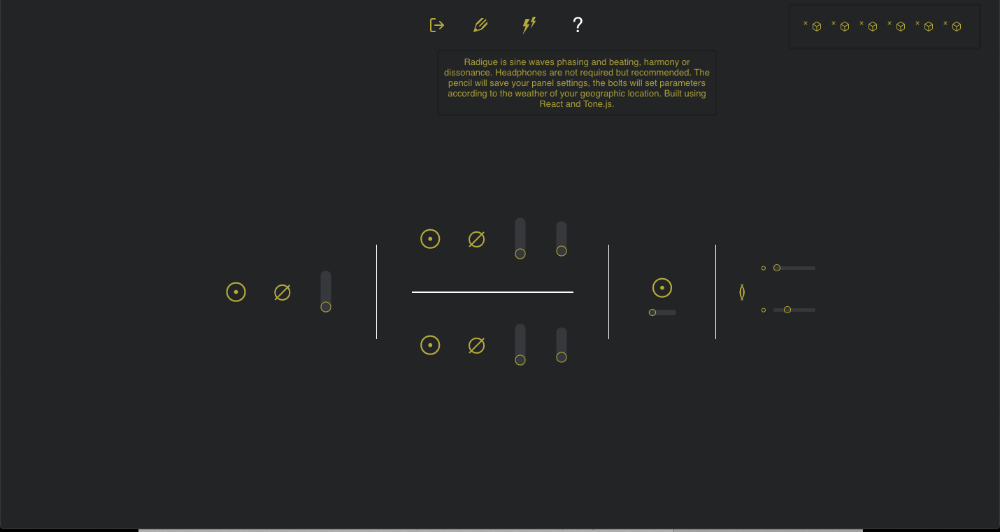

# Radigue

Final project for Concordia's web development program.
This application was written using React, Redux, Node, styled-components, Tone.js, Mongodb, and Firebase (for authentication).

Radigue is a single page application that uses Tone.js to create a mass of sine waves for meditative listening. The design is intenionally sparse and intentionally unlabeled, encouraging exploration. Users are able to save their settings via the pencil icon and recall or delete them using the cubes located top right. The lightning icon allows users to let the weather of their current location dictate the pages parameters.

